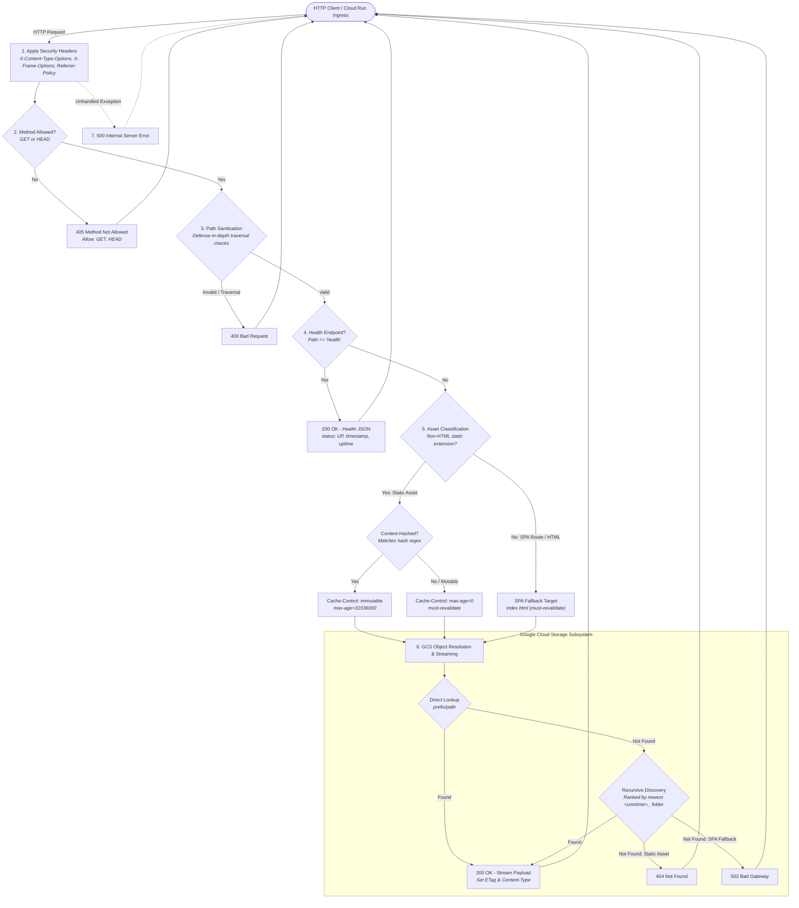

# Resume Web Server

[](https://github.com/nawaphonOHM/resume-web-server/actions/workflows/CI.yml)

An enterprise-grade, high-performance Node.js and TypeScript HTTP web server engineered to host and serve Single-Page Applications (SPA) — such as Angular-based resume web applications. The server streams static assets directly from Google Cloud Storage (GCS) buckets, featuring timestamped multi-version release resolution, automated SPA fallback routing (`index.html`), smart content-hash HTTP caching, multi-layered directory traversal defense, startup health check probes, and graceful connection lifecycle management on Google Cloud Run.

---

## Overview

`resume-web-server` operates as a lightweight, secure gateway between client browsers and cloud object storage. Rather than bundling frontend static assets into container images, the server decouples application builds from runtime containers by streaming static assets dynamically from Google Cloud Storage.

Key architectural benefits include:

- **Decoupled Deployments**: Frontend client builds can be uploaded directly to GCS bucket prefixes or timestamped folders without rebuilding or redeploying container instances.
- **Multi-Version Asset Resolution**: Resolves assets at the configured direct prefix path first, falling back to recursive discovery ranked by the newest `<unixtime>_<label>` directory.
- **Edge-Ready Caching & ETags**: Automatically calculates `Cache-Control` directives (immutable caching for hashed bundles and strict revalidation for mutable assets) and formats RFC 9110 compliant `ETag` response headers (weak `W/` prefix when decompressed).
- **Defense-in-Depth Security**: Applies strict HTTP method validation, multi-pass URI path sanitization, and baseline security headers on every request.
- **Cloud Run Native**: Integrated with Cloud Native Buildpacks, Workload Identity, `/health` startup probe, and graceful `SIGTERM`/`SIGINT` socket draining.

---

## Core Features & Capabilities

### 1. 7-Step Defensive Request Pipeline

Incoming requests traverse a deterministic 7-step pipeline designed for high throughput, defense-in-depth security, and predictable error handling. Every request is inspected, validated, classified, and routed to either the health monitor, static asset streamer, or SPA fallback.

### 2. Google Cloud Storage Streaming with Version Prioritization

- **Direct & Recursive Resolution**: Attempts direct path lookup under the configured `GCS_PREFIX` (`<prefix>/<path>`), falling back to recursive scanning to match the asset basename across subdirectories ranked by the newest timestamped folder prefix (format: `<unixtime>_<label>`, e.g., `1709294400_release`). Folders without timestamps rank after timestamped folders.
- **RFC 9110 ETag Headers**: Formats and sets `ETag` headers derived from GCS response headers (`GET`) or metadata (`HEAD`), formatting weak ETags (`W/"..."`) when decompressed on the fly or already weak.
- **HEAD Request Support**: Handles `HEAD` requests across all routes, returning metadata and content headers while immediately closing the response stream.

### 3. SPA Client-Side Routing Fallback

- Requests for extensionless paths (e.g., `/`, `/experience`, `/skills`) or HTML documents are identified by the `DefaultAssetClassifier` as SPA navigation routes.
- The router serves `index.html` from GCS as the fallback shell, enabling Angular client-side routing.
- If the SPA root file `index.html` is missing from the GCS bucket during an SPA fallback route, or if GCS encounters a non-404 upstream error, the server cleanly returns `502 Bad Gateway`.
- If a requested static asset file is missing from GCS, the server cleanly returns `404 Not Found` (upstream non-404 errors return `502 Bad Gateway`).

### 4. Smart HTTP Caching Policies

- **Content-Hashed Assets**: Files matching Angular/esbuild bundle hashes (e.g. `main-5T7P2N6K.js`, `styles-5INURTSO.css`) receive:
  ```http
  Cache-Control: public, max-age=31536000, immutable
  ```
- **Mutable & Root Files**: Known mutable assets (`index.html`, `favicon.ico`, `manifest.json`, `ngsw.json`) and unhashed assets receive:
  ```http
  Cache-Control: public, max-age=0, must-revalidate
  ```

### 5. Multi-Layer Path Traversal Protection

The `DefenseInDepthPathSanitizer` guards against path manipulation and directory traversal attacks via a 13-point inspection routine:

- Rejects null bytes (`\0`, `%00`), backslashes (`\`, `%5C`), and encoded forward slashes (`%2F`).
- Catches double-encoded traversal sequences (e.g. `%252e`, `%255c`, `%252f`).
- Enforces POSIX normalization and traps directory escape sequences (`../`, `/..`).
- Validates file extensions against a strict allowlist of recognized web MIME types (single-level files with unsupported extensions like `/x.env` or `/config.env` are rejected, whereas dotfiles like `/.env` and nested unknown extensions proceed to SPA fallback).
- Disallows static file extensions on nested sub-paths (only allowed at root level or routed via SPA fallback).
- Disallowed or malformed paths immediately receive `400 Bad Request`.

### 6. Standard Security Headers

Every outgoing HTTP response is automatically injected with baseline security headers:

- `X-Content-Type-Options: nosniff`: Prevents MIME-type sniffing.
- `X-Frame-Options: SAMEORIGIN`: Protects against clickjacking.
- `Referrer-Policy: strict-origin-when-cross-origin`: Restricts referrer leakage.

### 7. Graceful Lifecycle & Connection Draining

- **Active Socket Tracking**: `SocketConnectionTracker` tracks all open TCP connections and manages socket states.
- **Graceful Shutdown**: On receiving `SIGTERM` or `SIGINT`, `GracefulShutdownManager` stops accepting new connections, allows in-flight requests to complete within a configurable timeout (default 8s), and forcefully closes idle/lingering sockets before exiting cleanly.
- **Process Protection**: Registers global handlers for `uncaughtException` and `unhandledRejection` to ensure structured error logging and clean process termination.

### 8. Structured Winston Decision Telemetry

- Emits structured JSON and console logs powered by Winston.
- Includes a dedicated decision logger that records actionable routing, path sanitization, HTTP method validation, MIME resolution, cache policy selection, and storage lookup decisions.
- Automatically redacts sensitive query parameters and URL tokens from diagnostic output.

---

## Architecture & Request Lifecycle

The diagram below illustrates the complete request lifecycle across the server pipeline, security validators, cache policy resolvers, and Google Cloud Storage.



### Pipeline Execution Details

| Stage                       | Component                           | Description                                                                                                   | Failure / Exit Path                                                                                                |
| :-------------------------- | :---------------------------------- | :------------------------------------------------------------------------------------------------------------ | :----------------------------------------------------------------------------------------------------------------- |
| **1. Security Headers**     | `StandardSecurityHeadersPolicy`     | Injects `X-Content-Type-Options`, `X-Frame-Options`, and `Referrer-Policy` into the response.                 | Applied unconditionally.                                                                                           |
| **2. Method Validation**    | `StandardHttpMethodValidator`       | Verifies that the HTTP method is `GET` or `HEAD`.                                                             | `405 Method Not Allowed` with `Allow: GET, HEAD`.                                                                  |
| **3. Path Sanitization**    | `DefenseInDepthPathSanitizer`       | Strips queries/fragments, checks for null bytes, decodes URI, and blocks directory traversal.                 | `400 Bad Request`.                                                                                                 |
| **4. Health Probe**         | `DefaultHealthCheckHandler`         | Matches `/health` and returns system status JSON with uptime.                                                 | Handled immediately (`200 OK`).                                                                                    |
| **5. Asset Classification** | `DefaultAssetClassifier`            | Checks file extension against static asset registry vs HTML/SPA navigation routes.                            | Routes to static streaming or SPA fallback.                                                                        |
| **6. Storage Streaming**    | `GcsStorageService`                 | Locates file in GCS (direct lookup then timestamp-ranked recursive scan), sets ETag header, and streams body. | `404 Not Found` (static asset missing) or `502 Bad Gateway` (missing SPA index or non-404 upstream storage error). |
| **7. Error Handling**       | `Router` / `router_error_responder` | Traps unhandled exceptions across the lifecycle.                                                              | `500 Internal Server Error`.                                                                                       |

---

## Configuration

The server is configured entirely via standard environment variables. Configuration is validated and normalized at startup before the HTTP listener binds to the network interface.

### Environment Variables

| Variable          | Type    | Required | Default   | Constraints & Normalization Rules                                                                                                                                        |
| :---------------- | :------ | :------- | :-------- | :----------------------------------------------------------------------------------------------------------------------------------------------------------------------- |
| `PORT`            | Integer | No       | `8080`    | Must be a positive integer in the range `1..65535` parsed via `Number.parseInt(value, 10)`. Empty, unset, `NaN`, or values outside `1..65535` safely fallback to `8080`. |
| `HOST`            | String  | No       | `0.0.0.0` | Network host interface or IP address to bind to (`0.0.0.0` listens on all IPv4 interfaces). Automatically trimmed; empty falls back to default.                          |
| `GCS_BUCKET_NAME` | String  | **Yes**  | —         | Target Google Cloud Storage bucket containing frontend assets. Cannot be empty or whitespace-only.                                                                       |
| `GCS_PREFIX`      | String  | **Yes**  | —         | Target root folder/prefix within the GCS bucket. Leading and trailing forward slashes (`/`) and whitespace are automatically stripped.                                   |

### Validation and Startup Error Handling

- **Missing Required Variables**: If `GCS_BUCKET_NAME` or `GCS_PREFIX` (after slash trimming) are unset or empty, `assertRequiredVariables` logs a fatal error (`Missing required environment variable(s): ...`), invokes the configured exit handler with exit code `1`, and throws an Error.
- **Prefix Normalization**: Prefixes such as `/apps/resume/` or `///resume///` are normalized to `apps/resume` or `resume`. Slash-only values (e.g. `///`) result in an empty string and trigger a required variable validation failure.
- **Decision Telemetry**: Parameter resolution decisions are recorded in the structured logger with `action: 'Config'` at `debug` level, capturing `variable` (`PORT`, `HOST`, `GCS_BUCKET_NAME`, `GCS_PREFIX`), `resolved`, `choice`, and `reason`.

---

## HTTP Endpoints & Routing

The server exposes three primary request paths: health telemetry, static asset streaming, and SPA client-side navigation fallback.

### 1. Health Probe (`/health`)

- **Path**: `/health` (the router strips query strings, fragments, and leading/trailing slashes, so `/health/` and `/health?param=1` also match).
- **Allowed Methods**: `GET`, `HEAD`
- **Status**: `200 OK`
- **Response Headers**:
  - `Content-Type: application/json; charset=utf-8`
  - `Cache-Control: no-cache, no-store, must-revalidate`
  - `Content-Length: <byte_length>`
  - Baseline security headers (`X-Content-Type-Options`, `X-Frame-Options`, `Referrer-Policy`)
- **Response Format**:
  ```json
  {
    "status": "UP",
    "timestamp": "2026-10-10T03:06:00.000Z",
    "uptime": 124.582
  }
  ```
- **HEAD Behavior**: Emits identical headers including calculated `Content-Length`, but terminates immediately without writing the JSON body.
- **Cloud Run Startup Probe**: Configured in `cloudbuild.yaml` via `--startup-probe=httpGet.port=8080,httpGet.path=/health,timeoutSeconds=1,periodSeconds=10,failureThreshold=3`. Cloud Run monitors container startup health using this endpoint prior to sending incoming traffic.

### 2. Static Asset Streaming (`GET /<asset-path>`)

- **Path Classification**: Requests with recognized non-HTML file extensions (e.g. `.js`, `.css`, `.png`, `.svg`, `.woff2`, `.json`, `.ico`, `.wasm`).
- **Single-Level Path Constraint**: Static asset requests must target a single-level path parameter (`/{pathParam}`). Nested paths targeting static extensions (e.g. `/assets/logo.png` or `/nested/style.css`) are rejected by the path sanitizer with `400 Bad Request` (`"Static asset requests must target a single-level path parameter"`).
- **MIME Type Resolution**: Maps file extensions against `MIME_TYPES` (supporting 26 web extensions: 24 static asset extensions in `KNOWN_STATIC_EXTENSIONS` plus 2 HTML document extensions in `KNOWN_HTML_EXTENSIONS`), falling back to `application/octet-stream`.
- **Caching Directives**:
  - **Content-Hashed Assets**: Bundles matching `HASHED_ASSET_REGEX` (e.g. `main-5T7P2N6K.js`, `styles-5INURTSO.css`) receive `Cache-Control: public, max-age=31536000, immutable`.
  - **Mutable / Root Assets**: Assets starting with well-known mutable prefixes (`index.`, `ngsw`, `favicon`, `manifest`, `browserconfig`) or unhashed files receive `Cache-Control: public, max-age=0, must-revalidate`.
- **ETag**: Derived from GCS response `etag` header (`GET`) or `metadata.etag` (`HEAD`), formatted according to RFC 9110 (enclosed in double quotes, and prefixed with `W/` if the payload is decompressed on the fly or the raw ETag is already weak).
- **Responses**:
  - `200 OK`: Streams asset content chunks from GCS (or headers only for `HEAD`).
  - `404 Not Found`: Returned when the requested static asset does not exist in GCS under the direct path or any recursive candidate directory.
  - `502 Bad Gateway`: Returned if GCS returns a non-404 error (such as bucket missing, network interruption, or upstream storage failure).
  - **Mid-Stream Failure**: If an error occurs after response headers have already been sent (`headersSent: true`), the server aborts and immediately destroys the underlying socket (`res.destroy()`).

### 3. SPA Client-Side Routing Fallback (`GET /<route>`)

- **Path Classification**: Extensionless paths (e.g. `/`, `/experience`, `/projects`, `/skills/angular`), standalone dotfiles (e.g. `/.env`), nested navigation paths (including unknown nested extensions like `/user/profile.data`), and HTML documents (`.html`, `.htm`).
- **Behavior**: Directs the request to `index.html` from the GCS bucket to serve the SPA shell.
- **Headers**:
  - `Content-Type: text/html; charset=utf-8`
  - `Cache-Control: public, max-age=0, must-revalidate`
- **Responses**:
  - `200 OK`: Streams `index.html` from GCS.
  - `502 Bad Gateway`: Returned if `index.html` cannot be located in the GCS bucket during an SPA fallback route, or if GCS returns a non-404 error.
  - **Mid-Stream Failure**: If a streaming error occurs after response headers have been sent, the server destroys the underlying socket.

### 4. HTTP Method Validation

- **Allowed Methods**: `GET` and `HEAD`.
- **Unsupported Methods**: Any other HTTP method (`POST`, `PUT`, `DELETE`, `PATCH`, `OPTIONS`, `CONNECT`, `TRACE`) is rejected by `StandardHttpMethodValidator`.
- **Response**: `405 Method Not Allowed` with header `Allow: GET, HEAD` and plain text body `Method Not Allowed`.

---

## Security Policies & Traversal Defense

The server employs a defense-in-depth security model to safeguard static asset delivery and prevent unauthorized access or host exploitation.

### HTTP Security Headers

`StandardSecurityHeadersPolicy` injects baseline security headers unconditionally into every outgoing HTTP response:

```http
X-Content-Type-Options: nosniff
X-Frame-Options: SAMEORIGIN
Referrer-Policy: strict-origin-when-cross-origin
```

- **MIME Sniffing Prevention (`nosniff`)**: Forces browsers to adhere strictly to the declared `Content-Type`, mitigating drive-by script execution via user-supplied content.
- **Clickjacking Protection (`SAMEORIGIN`)**: Restricts framing to the same origin, preventing clickjacking attacks.
- **Referrer Privacy (`strict-origin-when-cross-origin`)**: Preserves full referrer paths on same-origin requests while restricting cross-origin HTTPS requests to origin-only.
- **External Security Policies**: The server application and repository configurations set only the three baseline security headers above. Transport security (`Strict-Transport-Security` / HSTS), Content Security Policy (`Content-Security-Policy` / CSP), and `Permissions-Policy` are not set by the application. In production deployments, these headers may optionally be attached externally (e.g. via custom response headers configured on an external HTTPS Cloud Load Balancer).

### Defense-in-Depth Path Traversal Sanitizer

The `DefenseInDepthPathSanitizer` enforces a 13-stage validation routine:

1. **Presence Check**: Rejects `undefined`, empty, or whitespace-only URLs (`400 Bad Request`).
2. **Decomposition**: Strips scheme and host (`http://`, `https://`), query strings (`?...`), and fragment identifiers (`#...`).
3. **Null Byte Rejection**: Detects and rejects raw null bytes (`\0`) and encoded null bytes (`%00`). (A lone `%0` is trapped later as a malformed percent-encoded sequence during URL decoding).
4. **Backslash Rejection**: Rejects Windows-style backslashes (`\`) to prevent cross-platform separator confusion.
5. **Encoded Separator Trap**: Traps encoded slashes (`%2f`, `%2F`, `%5c`, `%5C`).
6. **Double Encoding Check**: Traps multi-encoded payloads (e.g. `%252e`, `%252f`, `%255c`, `%2500`).
7. **Traversal Token Check**: Detects relative navigation tokens (`..`, `%2e%2e`, `%2e.`, `.%2e`).
8. **URI Decoding**: Safely executes `decodeURIComponent` with error trapping for malformed percent sequences.
9. **Decoded Character Check**: Re-evaluates decoded strings for hidden null bytes, backslashes, and traversal sequences.
10. **POSIX Normalization**: Normalizes path via `posix.normalize` and verifies that the normalized path does not escape the virtual root directory.
11. **Single-Level Static Constraint**: Enforces that static asset requests target single-level root files (e.g. `/main.js`), blocking nested directory requests (`/assets/main.js`).
12. **Extension Allowlist**: Rejects unsupported single-level file extensions (e.g. `.exe`, `.php`, `/x.env` or `/config.env`, `.tar.gz`, `.sh`, `.bin`). Note that standalone dotfiles (e.g. `/.env`) have an empty extension in Node.js path resolution and proceed to SPA fallback.
13. **SPA Path Preservation**: Safely permits multi-level extensionless paths (`/user/profile`), unknown nested extensions (`/user/profile.data`, `/user/john.doe`), and HTML extensions (`/docs/guide.htm`) for SPA routing.

---

## Google Cloud Storage Resolution Mechanism

Static asset streaming and SPA shell retrieval are managed by `GcsStorageService` and `StorageObjectLocator`.

```text
                  ┌──────────────────────────────────────────────┐
                  │           Locate File Request                │
                  │       (cleanName, configured prefix)         │
                  └──────────────────────┬───────────────────────┘
                                         │
                                         ▼
                     ┌────────────────────────────────────────┐
                     │          Phase 1: Direct Lookup        │
                     │          <prefix>/<cleanName>          │
                     └───────────────────┬────────────────────┘
                                         │
                            ┌────────────┴────────────┐
                            │                         │
                     [ File Exists ]           [ File Missing ]
                            │                         │
                            ▼                         ▼
                  ┌───────────────────┐    ┌──────────────────────────────────────┐
                  │ Return Direct File│    │      Phase 2: Recursive Discovery    │
                  │ strategy: direct  │    │  Scan all objects under <prefix>/    │
                  └───────────────────┘    └──────────────────┬───────────────────┘
                                                              │
                                                              ▼
                                                   ┌──────────────────────┐
                                                   │ Filter by Basename   │
                                                   └──────────┬───────────┘
                                                              │
                                                              ▼
                                                   ┌──────────────────────┐
                                                   │ Parse Timestamps     │
                                                   │ <unixtime>_<label>   │
                                                   └──────────┬───────────┘
                                                              │
                                                              ▼
                                                   ┌──────────────────────┐
                                                   │ Sort Candidates:     │
                                                   │ 1. Newest unixtime   │
                                                   │ 2. Untimestamped     │
                                                   │ 3. Path localeCompare│
                                                   └──────────┬───────────┘
                                                              │
                                                              ▼
                                                   ┌──────────────────────┐
                                                   │ Return Best Match    │
                                                   │ strategy: recursive  │
                                                   └──────────────────────┘
```

### Two-Phase Resolution Process

1. **Phase 1: Direct Path Lookup (`strategy: direct`)**:
   - Computes the direct object path: `<prefix>/<cleanName>`.
   - Checks file existence in GCS via `bucket.file(directPath).exists()`.
   - If found, the object is immediately streamed without scanning other directory objects.

2. **Phase 2: Recursive Candidate Discovery (`strategy: recursive`)**:
   - When direct lookup does not match, the locator performs a prefix search across the bucket (`collectFilesUnderPrefix`).
   - Filters candidate objects whose filename matches the requested basename (`relative.split('/').pop() === targetBasename`).
   - Parses deployment directory timestamps matching `<unixtime>_<label>` (e.g. `1709294400_release_v2`, `1700000000_build`) from the first-level directory name (`segments[0]`) under the prefix. Files located in deeper subdirectories beneath a timestamped directory inherit that directory's timestamp.
   - Sorts candidate files deterministically:
     - **Timestamped Directories**: Ranked from newest to oldest Unix timestamp (`b.unixtime - a.unixtime`).
     - **Untimestamped Directories**: Ranked after timestamped directories.
     - **Tie Breaking**: Sorted alphabetically by full object path (`localeCompare`).
   - Returns the highest-priority candidate object for streaming.

### RFC 9110 ETag Generation

- Retrieves `ETag` values from GCS response headers (`GET`) or `metadata.etag` (`HEAD`).
- If an object is decompressed on the fly (e.g., gzip `contentEncoding`) or if the raw ETag was already weak, the ETag is formatted as a weak validator (`W/"..."`).
- HEAD requests set headers (including `ETag` and `Content-Type`) and content length before cleanly ending the response.

---

## Local Development & Scripts

### Prerequisites

- **Node.js**: Node.js 22 (matches `@types/node` ^22; CI uses the `NODE_VERSION` repository variable).
- **npm**: Bundled with Node.js 22.
- **Google Cloud SDK (`gcloud` CLI)**: Recommended for local Google Cloud Storage authentication and Cloud Run management.
- **GCP IAM Permissions**: When running against an actual GCS bucket, credentials require `roles/storage.objectViewer` on the target bucket.

### Getting Started

1. **Clone the repository and install dependencies**:

   ```bash
   git clone https://github.com/nawaphonOHM/resume-web-server.git
   cd resume-web-server
   npm ci
   ```

2. **Authenticate with Google Cloud (for GCS bucket access)**:
   Authenticate your local development environment using Application Default Credentials (ADC):

   ```bash
   gcloud auth application-default login
   ```

   _Note: Alternatively, set the `GOOGLE_APPLICATION_CREDENTIALS` environment variable pointing to a service account key JSON file._

3. **Configure Environment Variables**:
   Export required and optional environment variables:

   ```bash
   export GCS_BUCKET_NAME="my-resume-assets-bucket"
   export GCS_PREFIX="resume"
   export PORT=8080
   export HOST="0.0.0.0"
   ```

4. **Start the Server**:
   - **Direct TypeScript Execution** (via `tsx`):
     ```bash
     npx tsx src/index.ts
     ```
   - **Compiled Node.js Execution**:
     ```bash
     npm run compile
     node dist/src/index.js
     ```

### Available NPM Scripts

| Script                 | Command                         | Description                                                                         |
| :--------------------- | :------------------------------ | :---------------------------------------------------------------------------------- |
| `npm run compile`      | `tsc`                           | Compiles TypeScript source files into JavaScript in `./dist` using `tsconfig.json`. |
| `npm run test`         | `tsx --test tests/**/*.test.ts` | Runs the test suite using Node.js built-in test runner executed via `tsx`.          |
| `npm run lint`         | `eslint .`                      | Runs ESLint to verify code quality and style standards.                             |
| `npm run check-format` | `prettier --check .`            | Checks repository files for formatting compliance without modifying them.           |
| `npm run formatting`   | `prettier --write .`            | Formats repository files in-place according to Prettier configuration.              |
| `npm run clean`        | `rm -rf dist`                   | Removes the `./dist` build output directory.                                        |

---

## CI/CD & Deployment

The repository uses automated GitHub Actions workflows combined with Google Cloud Build and Cloud Native Buildpacks to test, package, and deploy the service to Google Cloud Run.

### Deployment Prerequisites & Operations Configuration

To execute CI/CD workflows and run the service on Google Cloud Run, configure the following secrets, variables, and runtime settings:

#### 1. GitHub Repository Secrets (`DEPLOY.yml`)

| Secret                   | Description                                                                                   |
| :----------------------- | :-------------------------------------------------------------------------------------------- |
| `SERVICE_ACCOUNT`        | Google Cloud Service Account email used for Cloud Build execution and Cloud Run runtime.      |
| `GCP_PROJECT_NUMBER`     | GCP Project Number for the Workload Identity Federation provider URI.                         |
| `WORKLOAD_IDENTITY_POOL` | Workload Identity Pool ID for OIDC authentication.                                            |
| `PROVIDER`               | Workload Identity Provider ID.                                                                |
| `GCP_PROJECT_ID`         | Target Google Cloud Project ID.                                                               |
| `STAGING_BUCKET_NAME`    | GCS bucket used for staging Cloud Build source archives (`gs://$STAGING_BUCKET_NAME/source`). |

#### 2. GitHub Repository Variables (`DEPLOY.yml` & `CI.yml`)

| Variable          | Scope        | Description                                                                  |
| :---------------- | :----------- | :--------------------------------------------------------------------------- |
| `IMAGE_NAME`      | `DEPLOY.yml` | Target container image name.                                                 |
| `BUILDER`         | `DEPLOY.yml` | Cloud Native Buildpacks builder image (e.g. `gcr.io/buildpacks/builder:v1`). |
| `SERVICE_NAME`    | `DEPLOY.yml` | Target Google Cloud Run service name.                                        |
| `LOCATION`        | `DEPLOY.yml` | GCP region (e.g. `asia-southeast1`, `us-central1`).                          |
| `REPO_NAME`       | `DEPLOY.yml` | Target Google Artifact Registry Docker repository name.                      |
| `NODE_VERSION`    | `CI.yml`     | Node.js version installed in CI jobs (e.g. `22`).                            |
| `PACKAGE_MANAGER` | `CI.yml`     | Cache key for package manager in CI (e.g. `npm`).                            |

#### 3. Cloud Run Runtime & IAM Settings

- **Runtime Environment Variables**: The deployment step in `cloudbuild.yaml` does not pass `--set-env-vars`. Therefore, `GCS_BUCKET_NAME` and `GCS_PREFIX` must be pre-configured directly on the Cloud Run service revision. If these variables are not set, configuration validation fails at startup (exit code `1`) and the startup probe fails.
- **Service Account Permissions**: The service account (`$_SERVICE_ACCOUNT`) is configured as both the Cloud Build execution identity and the Cloud Run runtime identity. At runtime, it requires `roles/storage.objectViewer` on the asset bucket (`GCS_BUCKET_NAME`).
- **Port & Startup Probe**: The startup probe in `cloudbuild.yaml` hardcodes `httpGet.port=8080` and `httpGet.path=/health`. The container listening port must remain `8080`.
- **Public Access**: Cloud Run is configured with `--ingress=internal-and-cloud-load-balancing` and `--allow-unauthenticated`.

### Workflows Overview

- **Continuous Integration (`.github/workflows/CI.yml`)**:
  - **Trigger**: Pull requests targeting the `main` branch.
  - **`lint` Job**: Sets up Node.js via `actions/setup-node@v4` with `${{ vars.NODE_VERSION }}`, installs dependencies (`npm ci`), verifies formatting (`npm run check-format`), and runs ESLint (`npm run lint`).
  - **`test` Job**: Sets up Node.js, installs dependencies (`npm ci`), verifies `package-lock.json` clean state (`git diff --exit-code package-lock.json`), runs format and lint checks, compiles TypeScript (`npm run compile`), and executes the complete test suite (`npm run test`).

- **Continuous Deployment (`.github/workflows/DEPLOY.yml`)**:
  - **Trigger**: Configured on tag push with exact filter pattern `'v\d+\.\d+\.\d+'`.
    > **Note on Tag Filter Syntax**: GitHub Actions `on.push.tags` evaluates glob-style patterns, not regular expressions. In GitHub glob syntax, `\` is an escape character rather than a digit class specifier; thus, `'v\d+\.\d+\.\d+'` matches literal `'d'` characters rather than tags such as `v1.0.0`. For a narrower glob matching three numeric components, use `'v[0-9]+.[0-9]+.[0-9]+'`. This pattern does not express full semantic-version rules such as prerelease identifiers.
  - **Authentication**: Authenticates using GitHub OIDC and Google Cloud Workload Identity Federation (`google-github-actions/auth@v2`).
  - **Workflow Build Steps & Known Caveats**:
    - Generates short commit SHA (`SHORT_SHA`).
    - Substitutes placeholder tokens in `cloudbuild.yaml` with GitHub repository variables/secrets using `sed`.
    - Runs `npm run compile` to build TypeScript into `./dist`. _(Note: `DEPLOY.yml` does not execute `npm ci` or `actions/setup-node` prior to compilation; without installing dependencies into `node_modules`, `npm run compile` will fail to find the project's local TypeScript compiler (`tsc`) on standard GitHub-hosted runners)._
    - Runs `mv ./dist/* .` to reposition compiled files. _(Note: in standard POSIX environments where `./src` already exists and is non-empty, `mv ./dist/src .` will exit with an error because `mv` cannot overwrite a non-empty directory)._
    - Submits the build context to Google Cloud Build via `gcloud builds submit`.

### Cloud Build & Cloud Run Pipeline (`cloudbuild.yaml`)

Google Cloud Build executes a two-step deployment process:

1. **Step 1: Container Build via Cloud Native Buildpacks (`docker.io/buildpacksio/pack`)**:
   - Uses Cloud Native Buildpacks (`--builder=$_BUILDER`) to produce an OCI container image without a manual `Dockerfile`.
   - The runtime entrypoint is defined by `Procfile`:
     ```procfile
     web: node ./src/index.js
     ```
   - Publishes the resulting container image to Google Artifact Registry (`$_LOCATION-docker.pkg.dev/$PROJECT_ID/$_REPO_NAME/$_IMAGE_NAME:$_SHORT_SHA`).

2. **Step 2: Cloud Run Deployment (`gcr.io/cloud-builders/gcloud`)**:
   - Deploys the container image to Google Cloud Run as a managed service (`--platform=managed`).
   - **Ingress**: Restricted to internal and load-balancing traffic (`--ingress=internal-and-cloud-load-balancing`).
   - **Public Access**: Configured with `--allow-unauthenticated`.
   - **Service Account**: Runs under the dedicated execution service account (`$_SERVICE_ACCOUNT`).
   - **Startup Probe**: Configured with `--startup-probe=httpGet.port=8080,httpGet.path=/health,timeoutSeconds=1,periodSeconds=10,failureThreshold=3`.
